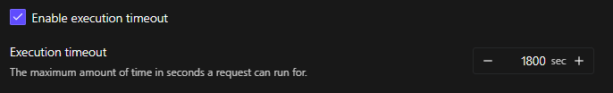

# COLMAP + Brush — 3DGS Pipeline (RunPod Serverless)

Generate 3D Gaussian Splatting (`.ply`) from a set of images using **COLMAP** for structure-from-motion and **Brush** for Gaussian Splat training. Packaged as a **RunPod Serverless** endpoint.

> ⚠️ This setup uses the **non-CUDA** (CPU-only) build of COLMAP installed via `apt-get`. SIFT feature extraction and matching run on the CPU, while only Brush training uses the GPU.
>
> ℹ️ Note: The current tests and setup are running on an **RTX 5090** GPU.

---

## Quick Start

### 1. Build & push the Docker image

```bash
cd COLMAP-Brush/serverless
docker build -t <your-registry>/colmap-brush-serverless .
docker push <your-registry>/colmap-brush-serverless
```

### 2. Create a RunPod Serverless Endpoint

1. Go to [RunPod Serverless](https://www.runpod.io/console/serverless)
2. Create a new endpoint using your pushed image
3. Select a GPU worker (e.g. RTX 5090)
4. **(Recommended)** Configure an S3-compatible bucket under **Endpoint Settings → Cloud Storage** to avoid the 20 MB response payload limit
5. **(Important)** Increase the **Execution Timeout** under Advanced Settings to at least `1800` seconds (or more), as the true duration heavily depends on your dataset size (number of images/resolution) and requested Brush iterations (`iterations`).

   

---

## API

### Request

`POST https://api.runpod.ai/v2/<endpoint_id>/run`

```json
{
  "input": {
    "images_url": "https://example.com/scene_images.zip",
    "s3_presigned_get_url": "https://my-bucket.s3.amazonaws.com/input.zip?X-Amz-...",
    "s3_presigned_put_url": "https://my-bucket.s3.amazonaws.com/output.ply?X-Amz-...",
    "iterations": 30000,
    "sh_degree": 3,
    "max_splats": null,
    "max_resolution": null,
    "densify_threshold": null
  }
}
```

### Input Fields

| Field                  | Type    | Required | Default | Description                          |
| ---------------------- | ------- | -------- | ------- | ------------------------------------ |
| `images_url`           | string  | ✅*      | —       | URL to a `.zip` archive of images    |
| `s3_presigned_get_url` | string  | ✅*      | —       | S3 presigned GET URL (alternative to `images_url`) |
| `s3_presigned_put_url` | string  | —        | —       | S3 presigned PUT URL for output upload |
| `iterations`           | int     | —        | `30000` | Number of Brush training steps       |
| `sh_degree`            | int     | —        | `3`     | Spherical harmonics degree           |
| `max_splats`           | int     | —        | —       | Maximum number of splats             |
| `max_resolution`       | int     | —        | —       | Max image resolution for training    |
| `densify_threshold`    | float   | —        | —       | Densification gradient threshold     |

*\*At least one of `images_url` or `s3_presigned_get_url` must be provided. If `s3_presigned_get_url` is provided, it takes priority.*

### Response

**With Presigned PUT URL / Bucket configured:**

```json
{
  "output": {
    "output_url": "https://your-bucket.s3.amazonaws.com/output.ply?..."
  }
}
```

**Without bucket (base64 fallback):**

```json
{
  "output": {
    "output_base64": "<base64-encoded PLY>",
    "filename": "output.ply"
  }
}
```

> ⚠️ RunPod serverless has a **20 MB response payload limit**. PLY files often exceed this, so configuring a bucket is strongly recommended.

---

## Pipeline Steps

1. **Download & Extract** — fetches the images `.zip` from the provided URL
2. **COLMAP Feature Extraction** — extracts SIFT features from input images
3. **COLMAP Exhaustive Matching** — matches features across image pairs
4. **COLMAP Mapper** — reconstructs a sparse 3D model
5. **COLMAP Model Converter** — exports the model to TXT format for Brush
6. **Brush Training** — trains a 3D Gaussian Splat model and exports `output.ply`
7. **Upload / Return** — uploads PLY to bucket or returns base64

---

## Output

The final output is a `.ply` file. You can view the result by uploading it to [SuperSplat](https://superspl.at/).

---

## Docker Image Details

| Layer           | What it installs                                 |
| --------------- | ------------------------------------------------ |
| Base image      | `runpod/pytorch:1.0.2-cu1281-torch280-ubuntu2404`|
| System packages | `colmap`, `wget`, `xz-utils`                    |
| Brush binary    | `brush-app-x86_64-unknown-linux-gnu` v0.3.0      |
| Python packages | `runpod`, `requests`                             |
