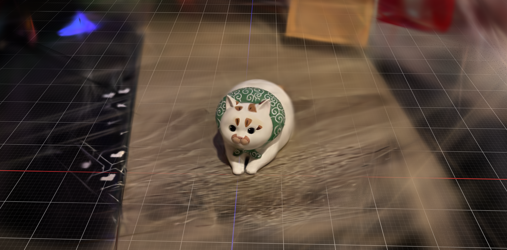

# 3DGS-Runpod

Generate **3D Gaussian Splatting** (`.ply`) from a set of images on [RunPod](https://www.runpod.io/) GPU infrastructure.

The pipeline uses **COLMAP** (non-CUDA, CPU-only) for structure-from-motion and **Brush** for Gaussian Splat training.

### Example Output

*(Result of 5,000 steps from the example dataset)*



---

## Pipelines

### COLMAP + Brush

| Mode | Description | Docs |
| ---- | ----------- | ---- |
| **Pod** | Interactive — run the script manually on a RunPod GPU pod | [README](COLMAP-Brush/pod/README.md) |
| **Serverless** | API-driven — deploy as a RunPod serverless endpoint | [README](COLMAP-Brush/serverless/README.md) |
| **Flash** | API-driven — deploy with RunPod Flash (no Dockerfile needed) | [README](COLMAP-Brush/flash/README.md) |

---

## Client

A dedicated Python client is available to interact with the RunPod Serverless endpoints. The client script features:

- Automatic zipping of local images
- Uploading input data to an AWS S3 bucket and generating presigned URLs (GET/PUT)
- Submitting and polling the RunPod Job
- Automatically downloading the resulting `.ply` file

For full details, prerequisites, and usage examples, please refer to the [Client README](client/README.md).

---

## Repository Structure

```
3DGS-Runpod/
├── COLMAP-Brush/
│   ├── pod/                  # RunPod Pod (interactive)
│   │   ├── runpod_pod.py
│   │   └── README.md
│   ├── serverless/           # RunPod Serverless (API)
│   │   ├── runpod_serverless.py
│   │   ├── Dockerfile
│   │   └── README.md
│   └── flash/                # RunPod Flash (no Dockerfile)
│       ├── runpod_flash_endpoint.py
│       └── README.md
├── LICENSE
└── README.md
```

---

## License

This project is licensed under the [Apache License 2.0](LICENSE).
